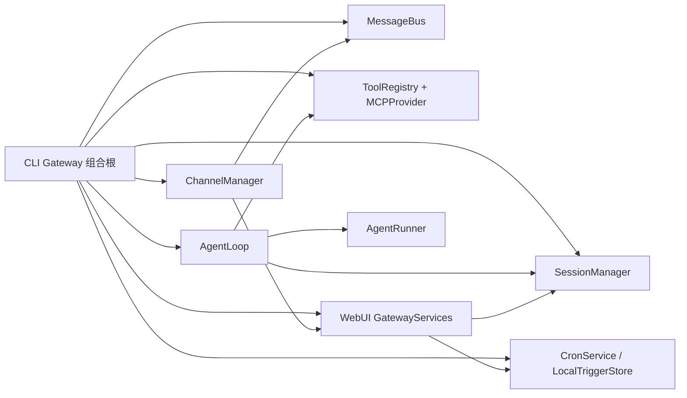

# nanobot 运行时认知地图

本文是中文代码注释工程的共同认知基线。结论来自当前源码中的入口、构造、导入、协议类型和调用链；`docs/architecture.md`、`.agent/design.md`、`.agent/security.md` 与 `.agent/gotchas.md` 只用于校验意图，不替代源码证据。覆盖范围与后续批次见 [`coverage.md`](coverage.md)。

## 1. 组合根与生命周期

### 1.1 进程入口

| 入口 | 实际构造路径 | 生命周期与清理 | 代码所有者 |
| --- | --- | --- | --- |
| 模块/CLI | `nanobot/__main__.py` 调用 `nanobot.cli.commands.app`；`serve` 在 `nanobot/cli/commands.py` 中加载配置，构造 `MessageBus`、`SessionManager`、`ToolRegistry`、`MCPProvider` 和 `AgentLoop.from_config`，再挂载 aiohttp OpenAI 兼容 API | 应用启动时连接 MCP；aiohttp cleanup 先 `AgentLoop.aclose()`，后 `MCPProvider.aclose()` | `nanobot/__main__.py`、`nanobot/cli/commands.py`、`nanobot/api/server.py` |
| 交互 CLI | 命令注册在 `nanobot/cli/agent.py`；一次性和交互模式最终都通过 SDK/AgentLoop 处理消息 | 终端流式输出和取消由 CLI 层拥有，不改变 Agent 核心所有权 | `nanobot/cli/agent.py`、`nanobot/cli/stream.py`、`nanobot/cli/terminal.py` |
| Python SDK | `Nanobot.from_config` 解析配置与环境，构造 `ToolRegistry`、`MCPProvider`、`AgentLoop`；`run`/`run_streamed` 懒连接 MCP 后调用 `process_direct` | `RunStream` 把结构化事件放入队列；`Nanobot.aclose` 先关闭 loop，再关闭 MCP | `nanobot/nanobot.py`、`nanobot/sdk/runtime.py`、`nanobot/sdk/types.py` |
| Gateway | `_run_gateway` 构造总线、运行时事件总线、Provider 快照、Session、Cron、Trigger、Delivery、Tools/MCP、AgentLoop、WebuiTurnCoordinator、ChannelManager | 启动 cron/MCP/agent/channels/trigger/health/config watcher；退出先停 Channel，再取消运行任务，随后关闭 Agent/MCP、`SessionManager.flush_all()` | `nanobot/cli/gateway_runtime.py`、`nanobot/channels/manager.py` |
| OpenAI API | `serve` 挂载 `/v1/chat/completions`、`/v1/models`；每个 API session 有锁，聊天调用 `AgentLoop.process_direct`，SSE 转换流事件 | 非 loopback 绑定必须有 API key；API 会话使用固定 channel 语义且仍进入同一 Agent/Session 内核 | `nanobot/cli/commands.py`、`nanobot/api/server.py`、`nanobot/api/runtime.py` |
| 外部 Channel | `ChannelManager` 通过 manifest/registry 发现启用的 channel，给每个实例注入同一个 `MessageBus`；WebSocket 额外接收 Gateway services | manager 启停适配器并独占 outbound dispatch；动态设置可增删 channel 实例 | `nanobot/channels/manager.py`、`nanobot/channels/registry.py`、`nanobot/channels/plugin.py` |
| WebUI | `webui/src/main.tsx` 初始化 i18n 并挂载 `App`；`App` 获取 bootstrap token/WS URL，只创建一个 `NanobotClient`，再由 Shell/Provider/Hook 分发状态 | 浏览器连接复用多个 chat；后端 WebSocket channel 与 HTTP handler 共用同一 `websockets` 监听器 | `webui/src/main.tsx`、`webui/src/App.tsx`、`webui/src/lib/nanobot-client.ts`、`nanobot/channels/websocket/runtime.py` |

### 1.2 Gateway 对象图



这里的边不是“目录关系”：构造顺序和注入参数可分别在 `nanobot/cli/gateway_runtime.py` 的 `_run_gateway`、`AgentLoop.from_config`、`ChannelManager(...)` 处核对。`MCPProvider` 由组合根拥有，不能因为 `AgentLoop` 引用了它就由 loop 重复关闭。

### 1.3 运行与退出顺序

1. `nanobot/cli/gateway_runtime.py` 先解析有效配置与 workspace，再生成不可变 Provider snapshot 和 session/runtime 服务。
2. `AgentLoop.from_config` 在 `nanobot/agent/loop.py` 中组装 provider、context、memory、runner、tools、hooks 和 workspace scope resolver。
3. Cron 与 MCP 先启动；`AgentLoop.run()`、`ChannelManager.start_all()`、本地 trigger 队列、健康服务和配置 watcher 作为并发运行任务启动。
4. 停止时先阻断新 channel 输入，再取消/限时等待运行任务；`AgentLoop.aclose()` 取消活跃 turn、后台任务、subagent 与 exec session；之后才关闭 MCP，并强制 flush session。
5. `nanobot/process_runtime.py` 在进程外层拥有 PID 身份、文件锁、原子状态文件与平台相关停止信号，不能与 Gateway 内部 async 生命周期混为一层。

## 2. 主消息链路

```mermaid
sequenceDiagram
  participant Ch as Channel/BaseChannel
  participant Bus as MessageBus
  participant Loop as AgentLoop
  participant Sess as SessionManager
  participant Run as AgentRunner
  participant Prov as LLMProvider
  participant Tools as ToolRegistry
  participant Out as ChannelManager

  Ch->>Bus: publish_inbound(InboundMessage)
  Bus->>Loop: consume_inbound()
  Loop->>Sess: restore / compact / persist user
  Loop->>Run: AgentRunSpec + hooks + delivery
  Run->>Prov: chat or chat_stream
  Prov-->>Run: text/reasoning/tool calls/provider state
  Run->>Tools: prepare + execute tool call
  Tools-->>Run: ToolResult / progress / checkpoint
  Run-->>Loop: AgentRunResult
  Loop->>Sess: sanitize + save + schedule memory
  Loop->>Bus: publish_outbound(OutboundMessage/events)
  Bus->>Out: consume_outbound()
  Out->>Ch: send/delta/reasoning/progress
```

### 2.1 入站和调度

- Channel 适配器在自身协议处理器中规范化 sender/chat/content/media，统一调用 `BaseChannel._handle_message`。此处先做 allowlist/pairing，再构造 `nanobot.bus.events.InboundMessage` 并发布到 `MessageBus`。
- `InboundMessage.session_key` 在有 override 时使用 override，否则是 `channel:chat_id`；定义在 `nanobot/bus/events.py`。总线在 `nanobot/bus/queue.py` 中只有独立的 inbound/outbound `asyncio.Queue`，不承担业务状态。
- `AgentLoop.run` 消费 inbound：runtime control 与优先命令可内联处理；活跃 session 的新消息进入 pending injection；新 turn 交给 `_dispatch`。`_dispatch` 用 per-session lock 串行同一会话，并用可选全局 semaphore 限制跨会话并发，见 `nanobot/agent/loop.py`。

### 2.2 单 turn 阶段

`AgentLoop._process_message` 的真实阶段是 **restore → compact → command → build → run → save → respond**：

| 阶段 | 责任 | 源码定位 |
| --- | --- | --- |
| restore | `get_or_create` session；应用 transient policy；从消息/旧 metadata 解析并持久化 `WorkspaceScope`；恢复 checkpoint/provider state | `nanobot/agent/loop.py`、`nanobot/session/manager.py`、`nanobot/security/workspace_access.py` |
| compact | TTL/容量条件触发会话压缩；保护工具调用/结果配对和 provider 兼容状态 | `nanobot/agent/autocompact.py`、`nanobot/session/manager.py` |
| command | `CommandRouter` 处理内建命令；自动化或 WebUI system turn 可有专门 delivery 行为 | `nanobot/command/router.py`、`nanobot/command/builtin.py`、`nanobot/agent/loop.py` |
| build | 选定本 turn 的 `LLMRuntime`；重放公开 history；构造可信 `RuntimeContext`、调用者 `RequestContext` 和系统 prompt；用户消息提前持久化 | `nanobot/agent/context.py`、`nanobot/runtime_context.py`、`nanobot/agent/tools/context.py` |
| run | 绑定 request/file/workspace ContextVar，创建 `AgentRunSpec`，由 `AgentRunner` 执行 provider/tool 多轮循环 | `nanobot/agent/loop.py`、`nanobot/agent/runner.py` |
| save | 去除 data URL/大图内容，校验 tool-result 配对、截断工具结果，保存 assistant/history/provider state，清 pending/checkpoint，安排 memory consolidation | `nanobot/agent/loop.py`、`nanobot/session/manager.py`、`nanobot/agent/memory.py` |
| respond | delivery 发布 stream/final/runtime 事件；已经流式交付的最终正文不会重复发送 | `nanobot/agent/turn_delivery.py`、`nanobot/bus/outbound_events.py` |

### 2.3 AgentRunner 内环

`AgentRunner.run`（`nanobot/agent/runner.py`）拥有模型迭代而非会话生命周期：

- `context_governance` 在请求前治理 token/context；provider 通过 `LLMRuntime.provider` 发起 `chat`/`chat_stream`，超时、可重试异常和空响应在 runner 中恢复。
- 流式 reasoning/text 经过 hook/delivery 逐块发出；完整响应保留 finish reason、usage 和 provider state。
- tool calls 由 `ToolRegistry.prepare` 校验/标准化，再由 `execute` 运行。进度、文件编辑、checkpoint 和 tool result 回到同一 turn；工具可通过 ContextVar 读取 `RequestContext`、workspace 和状态服务。
- pending 用户注入、显式持续目标和 max-iteration 恢复决定是否继续下一次 LLM 调用；runner 不直接写 JSONL，最终由 loop 的 save 阶段持久化。

### 2.4 出站交付

- `AgentLoop` 通过 `TurnDelivery` 发布 `OutboundMessage` 与 runtime events；事件契约分布在 `nanobot/bus/events.py`、`outbound_events.py`、`progress.py`、`runtime_events.py`。
- `ChannelManager._dispatch_outbound` 消费 outbound，按 channel 能力过滤 progress/reasoning，合并 delta，做重试退避，再调用适配器的 `send`、`send_delta/end`、`send_reasoning_delta/end`。
- 每个 Channel 仍拥有平台长度切分、媒体上传、消息引用/编辑和平台 rate limit；manager 只提供跨适配器的一致调度，见 `nanobot/channels/base.py` 与各 `nanobot/channels/*/runtime.py`。

## 3. 状态所有权

| 状态 | 权威存储/所有者 | 写入点 | 读取/传播点 |
| --- | --- | --- | --- |
| Session | `SessionManager` + agent workspace 外的运行时数据目录 `sessions/<workspace-id>` 中的 JSONL | loop save、命令、WebUI/Cron 状态服务 | context 重放、WebUI transcript/list、API/SDK snapshot |
| Provider state | `Session.provider_state` | runner 返回后由 loop 保存；兼容压缩时更新 | 下次 `AgentRunSpec` 与 provider Responses/Codex 状态恢复 |
| Memory | agent workspace 下 `memory/MEMORY.md`、`history.jsonl`，由 `MemoryStore` 所有 | turn save 后的两阶段 Dream/consolidation | `ContextBuilder` 的 agent 记忆段；不随 project workspace scope 漂移 |
| Goal | session metadata 的 `goal_state`；读取兼容旧 `thread_goal` | `long_task` 工具与命令写入并立即保存/发 runtime event | runner continuation/timeout、RuntimeContext、WebUI `goal_state/status/turn_end` |
| Cron | `CronService` 管理 `cron/jobs.json` 与 run 记录 | cron tools、HTTP/WS settings mutation、调度器 | `CronTurnCoordinator` 避免和活跃 session 冲突，必要时延迟注入 AgentLoop |
| Local trigger | `LocalTriggerStore` 与 trigger queue | CLI/WebUI trigger 管理 | Gateway 运行任务转为绑定或独立 turn |
| RuntimeContext | 每 turn 解析出的可信 block，不是历史中的用户 metadata | channel trusted block、工具/注册 provider 顺序构造 | 作为有边界标记的后缀加入当前模型输入；公开 history 按 durable marker 精确剥离 |
| RequestContext | caller-owned attributes 的 ContextVar | API/SDK/Channel 入站 | 工具读取；与可信 runtime metadata 分离 |
| WorkspaceScope | WebSocket 消息或 session metadata；`WorkspaceScopeResolver` 解析 | WebUI `set_workspace_scope` 或 turn 入站持久化 | ContextBuilder 读取项目 `AGENTS.md`；文件/shell/search 工具取 project path 与 access mode |
| WebUI turn/transcript | `WebuiTurnCoordinator`、transcript/session 索引 | WebSocket ingress 先持久化 user，再发布总线；runtime persisted event 收尾 | 浏览器事件、HTTP canonical refresh、fork/delete/list |

两个容易误注释的边界：

1. `WorkspaceScope.project_path` 决定项目文件和项目 `AGENTS.md`；agent 的 SOUL/USER/profile/memory/skills 仍来自配置的 agent workspace（`nanobot/agent/context.py`、`nanobot/security/workspace_access.py`）。
2. `RuntimeContext` 是可信运行时信息，`RequestContext.attributes` 是不可信调用者数据；二者故意不共用 metadata 通道（`nanobot/runtime_context.py`、`nanobot/agent/tools/context.py`）。

## 4. Provider、Tool、Channel 扩展点

| 扩展面 | 发现/注册 | 调用契约 | 兼容责任 |
| --- | --- | --- | --- |
| Provider | `nanobot/providers/registry.py` 的有序 `ProviderSpec` 与配置查找；`factory.py` 实例化 | `LLMProvider.chat/chat_stream` 返回 `LLMResponse`/stream chunks | registry/factory 处理 model 前缀、reasoning、prompt cache、max token 参数、Responses state、fallback 和代理配置 |
| Tool | `nanobot/agent/tools/registry.py` 内建扫描、entry point/plugin/MCP 注册 | `Tool.prepare` + `Tool.execute`，schema 和 ContextVar 由 base/context 提供 | 名称冲突、权限、运行时上下文 provider、checkpoint/progress 均由 registry/runner 边界处理 |
| Channel | package manifest + `nanobot/channels/registry.py`；manager 按配置创建实例 | `BaseChannel.start/stop/send` 与可选 streaming/reasoning 方法；入站统一 `_handle_message` | 各适配器拥有平台协议、限长、媒体与重试；manager 只做生命周期和一致出站 |
| App/CLI app | `nanobot/apps/protocol.py` 与 `nanobot/apps/cli/*` | manifest、安装状态、运行命令及 runtime context | 进程执行和安装权限不能当作普通纯函数 |
| Hook | `AgentHook`/turn hook factory/CompositeHook | run/turn/tool/file-edit 等 hook 上下文 | hook 异常隔离、ephemeral 是否运行额外 hook 由 loop/SDK 参数决定 |

Provider 不是“OpenAI 兼容请求的一套 if”：`factory.py` 会分派 OpenAI Codex、xAI、Azure、GitHub Copilot、Anthropic、Bedrock 等专用实现，其余才走通用 OpenAI-compatible；`registry.py` 的匹配顺序是唯一 Provider 元数据来源。中文注释应把差异归因到这些所有者，不要在 runner 中重复解释后端细节。

## 5. WebUI 前后端协议

### 5.1 鉴权与连接建立

1. `App` 从 URL hash 消费一次 bootstrap secret（并立即从地址栏移除），或读取 localStorage 保存的 secret；`webui/src/lib/bootstrap.ts` 请求 `/webui/bootstrap`。
2. `GatewayHTTPHandler` 在 `nanobot/webui/ws_http.py` 校验 bootstrap secret、本机浏览器或可信代理，返回短期一次性 token、`ws_path` 与可选 public WS URL。
3. `deriveWsUrl` 把 token 放进 WS query；`WebSocketChannel._dispatch_http` 仅把真实 Upgrade 交给握手鉴权，普通 HTTP 交给同一监听器上的 `GatewayHTTPHandler`。
4. 握手接受静态 token、一次性 issued token 或可信代理断言。issued token 的 audience 为 `webui` 时，连接加入 `_webui_connections`；只有该集合中的连接可以调用 WebUI mutation。

鉴权失败的 401/403 会让 `App` 进入重新输入 secret 的认证界面。`WebSocketConfig` 在 `nanobot/channels/websocket/runtime.py` 强制：通配地址绑定必须配置 token/issue secret/可信代理之一；trusted proxy CIDR 不能是全网段，断言 header 不能复用路由 header。

### 5.2 一条连接复用多会话

- `webui/src/lib/nanobot-client.ts` 的单个 `NanobotClient` 保存 known chat、临时 chat、listener、generation/fence 和 pending request；Shell 下的组件通过 `ClientProvider` 与 hooks 共享它。
- 客户端 frame 包括 `new_chat`、`new_temporary_chat`、`fork_chat`、`attach`、`set_workspace_scope`、`transcribe_audio`、`message` 和 `webui_request`；服务端在 `WebSocketChannel._dispatch_envelope` 按类型校验。
- 普通 known chat 在断线重连后重新 attach；临时 chat 属于原连接，不自动重挂。退避从 0.5 秒增长到 15 秒上限，并可触发 reauth/refresh bootstrap。
- `WebUIIngressPolicy` 在 `nanobot/webui/ingress_policy.py` 统一校验 chat id、文本/附件大小、媒体 envelope 和临时会话规则；服务端在 await 后再次检查连接 allowlist，先写 transcript，再发布 bus，最后发送 `message_accepted`。

### 5.3 事件、刷新与竞态

Python 发出的 WS 事件与 `webui/src/lib/types.ts` 的 `InboundEvent` 对齐，关键类别是：

| 类别 | 事件 | 前端责任 |
| --- | --- | --- |
| 文本/推理流 | `message`、`delta`、`stream_end`、reasoning delta/end | 以 chat/turn/stream id 聚合；generation/fence 丢弃迟到旧帧 |
| 工具和文件 | tool progress、`file_edit` | 构造 activity/run，必要时刷新文件预览 |
| turn 状态 | status、`goal_state`、`turn_end` | `turn_end` 是耗时和最终 goal snapshot 的权威收尾；run strip 从 goal/status 派生 |
| 会话状态 | attached/new chat、`session_updated`、title/model/runtime events | 触发 hooks 的 sessions/thread/model canonical refresh |
| 请求/回复 | `webui_response` | 以 request id 完成一次 mutation promise；超时后不自动重放，避免服务端已完成却重复变更 |

浏览器先用 WS 获得低延迟事件，再通过 HTTP transcript/session/settings 拉取权威快照；因此“收到 `session_updated` 后刷新”不是重复逻辑，而是事件通知 + canonical reconciliation。相关所有者为 `nanobot/session/webui_turns.py`、`nanobot/webui/transcript.py`、`webui/src/hooks/*` 和 `nanobot-client.ts`。

### 5.4 设置更新

- 读取型设置走 `GatewayHTTPHandler` 的 `/api/settings/*` 路由；修改既可走 HTTP，也可由 `webui_request` 映射到同一个 mutation router，映射表在 `nanobot/webui/ws_http.py`。
- 服务端 settings controller/service 在 `nanobot/webui/settings_api.py`、`settings_services.py`、`settings_controllers.py` 写配置并发布 model/config/runtime 失效事件。
- Channel 启用/禁用由 `ChannelManager` 动态应用；需要重启的 runtime/browser/image 能力通过 payload 明确返回，前端 settings contracts/controller 不应自行猜测。

## 6. 安全与兼容边界

| 边界 | 不变量 | 代码所有者 |
| --- | --- | --- |
| 路径约束 | `resolve_allowed_path` 对解析后的真实路径做 containment；额外单文件白名单还要求 logical path 与 resolved path 完全一致，防止符号链接借道。Workspace guard 是应用级策略，不等于 OS 沙箱 | `nanobot/security/workspace_policy.py`、`workspace_access.py`、`nanobot/agent/tools/filesystem.py`、`path_utils.py` |
| SSRF | 仅 http/https；解析 DNS 后阻断 loopback/private/link-local/metadata/IPv4-mapped 地址；显式 CIDR 白名单例外；请求 transport 固定已验证 DNS，redirect 目标重验。可信远端代理 DNS 是单独信任边界 | `nanobot/security/network.py`、`nanobot/agent/tools/web.py`、`shell.py`、`mcp.py` |
| Shell | restricted 模式先解析 cwd/绝对路径/转义与 URL，再施加 workspace guard；可选 Bubblewrap 才是系统级隔离，macOS/Windows 路径另有实现。不能把 `restrict_to_workspace` 注释成完整进程沙箱 | `nanobot/agent/tools/shell.py`、`sandbox.py`、`_windows_job.py`、`nanobot/security/workspace_access.py` |
| 配对 | `allowFrom` 精确匹配或 `*`，否则查询 pairing store；未授权 DM 只发短期 code，群聊直接拒绝。store 读取异常 fail closed，修改用锁和原子写；WebSocket 走握手鉴权而不是 DM pairing | `nanobot/channels/base.py`、`nanobot/pairing/store.py`、`nanobot/channels/websocket/runtime.py` |
| 持久化 | Session JSONL 使用文件锁、临时文件 + `os.replace`，关键 flush fsync 文件/目录；workspace marker 防碰撞/符号链接。Memory history 原子重写并 fsync；pairing/config helpers 复用原子写 | `nanobot/session/manager.py`、`nanobot/agent/memory.py`、`nanobot/utils/helpers.py`、`nanobot/pairing/store.py` |
| Provider 差异 | reasoning 字段、thinking 参数、token 字段、prompt cache、Responses continuation/compaction、model prefix 和 fallback 均是显式兼容策略 | `nanobot/providers/registry.py`、`factory.py`、各 provider 与 `openai_responses/*` |
| Channel 协议限制 | BaseChannel 只定义最小契约；文本限长、平台 markdown、媒体下载/上传、ack/edit/rate limit 由适配器负责。WebSocket 另有 frame 上限、ping、chat/attachment/text ingress 限制 | `nanobot/channels/base.py`、各 `nanobot/channels/*/runtime.py`、`nanobot/channels/websocket/runtime.py`、`nanobot/webui/ingress_policy.py` |
| WebUI 信任 | HTTP 与 WS 同端口但不同鉴权分支；只有 audience 为 `webui` 的连接能做 mutation。设置 mutation 不自动重试，且 chat allowlist 在异步边界后复核 | `nanobot/channels/websocket/runtime.py`、`nanobot/webui/ws_http.py`、`webui/src/lib/nanobot-client.ts` |
| 跨平台进程 | PID 存活不等于目标进程身份；状态保存 PID/create-time/命令身份并用锁保护，Windows/Unix 信号与 job object 不同 | `nanobot/process_runtime.py`、`nanobot/agent/tools/exec_session.py`、`_windows_job.py` |

## 7. 中文注释批次依赖

后续批次按 [`coverage.md`](coverage.md) 的唯一归属执行，跨批次依赖顺序如下：

1. **B1 核心代理与消息总线**先确定事件、turn 阶段和 runner 内环语义。
2. **B2 工具、扩展与安全边界**依赖 B1 的 ContextVar、hook、checkpoint 与 delivery 契约。
3. **B3 Provider 与媒体**依赖 B1 的 provider request/response 语义，但拥有后端兼容细节。
4. **B4 Channel 与配对**依赖 Bus/Outbound 契约；平台差异留在适配器。
5. **B5 会话、记忆与自动化**贯穿 B1/B4，拥有持久化和恢复语义。
6. **B6 组合根、配置、CLI/API/SDK**在上述构件稳定后说明装配与清理，而不复制内部实现。
7. **B7 WebUI 后端与协议服务**连接 B4/B5/B6 的 HTTP、WS、transcript、settings。
8. **B8 WebUI 外壳、设置与工作台**依赖 B7 的 bootstrap/settings/session 协议。
9. **B9 WebUI 对话、流式渲染与媒体**依赖 B1/B7 的 turn/event 语义。

注释时若一个文件跨多个领域，以 `coverage.md` 的主批次为准，在注释中链接真实所有者；不要通过复制相邻模块说明来制造第二个“权威来源”。
