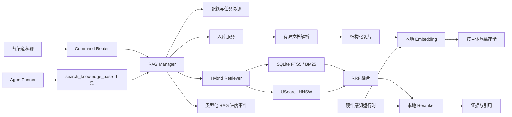

# 本地私人 RAG 设计

**状态：** 设计已确认

**日期：** 2026-08-11

**范围：** 按用户隔离的 RAG 第一版生产实现

## 1. 摘要

为 nanobot 增加一套可选、完全本地化的 RAG 子系统。用户可以在任意支持的渠道私聊中，通过 `/rag add` 明确把附件加入私人知识库；之后既可以使用 `/rag ask <问题>` 强制查询，也可以让 Agent 自主调用 `search_knowledge_base` 工具。

Embedding 和 Reranker 全部在本机运行。检索流程组合中英文 BM25 与 Dense 检索，使用 RRF 融合候选，再通过本地 Cross-Encoder 重排，最终返回带来源位置的证据和引用。

第一版优先保证隐私、资源可控、引用准确和严格用户隔离，不包含 OCR、共享知识库、跨渠道身份关联、远程 Embedding、远程 Reranker、GraphRAG 等高级检索策略。

## 2. 已确认的产品决策

- RAG 用户身份为 `(channel, sender_id)`。
- 同一个人在 Telegram、Discord 和 WebUI 中视为三个独立用户。
- 只有私人知识库，不提供团队、群组或公共知识库。
- 只有渠道能明确确认身份可信且当前为私聊时，才允许使用私人 RAG；未知会话类型失败即关闭。
- 所有能够提供可信身份与私聊范围的渠道都支持上传。
- 只有消息明确包含 `/rag add` 时，附件才持久进入知识库；普通附件只用于当前对话。
- `/rag ask <问题>` 强制检索；普通对话由 Agent 决定是否调用 `search_knowledge_base`。
- 每用户默认配额为 1 GiB，由系统配置控制。
- 配额只统计上传原始文件大小；Chunk、Embedding、BM25 和向量索引不计入用户配额。
- 入库异步且持久化。新文档处理中，旧的已就绪文档仍可查询。
- 第一版 Embedding 与 Reranker 均只允许本地执行。
- 默认模型组合为 `intfloat/multilingual-e5-small` 与 `BAAI/bge-reranker-base`。
- Windows、macOS、Linux 必须支持 CPU-only；GPU、Apple Neural Engine 等只作为自动选择的可选加速。
- 最低语言范围为中文、英文和中英混合内容。
- 第一版不做 OCR；扫描版 PDF、图片和文档内嵌图片中的文字不入库。
- WebUI 和聊天渠道必须展示 RAG 进度，避免用户误以为系统卡死。

## 3. 目标与非目标

### 目标

1. 为接近每用户 1 GiB 的私人语料提供可靠 Hybrid 检索。
2. 从设计上阻止跨用户和跨渠道检索。
3. 文档解析、切片、Embedding、词法检索、向量检索和 Reranker 全部在本机运行。
4. 让最终答案能够准确引用文件名及页码、标题、幻灯片、工作表或行号。
5. 通过异步入库、查询优先、有界并发和进度事件保持响应性。
6. RAG 保持可选，不启用时不改变 nanobot 基础安装和运行行为。
7. 同一套运行接口可以利用 Apple Silicon、NVIDIA、Intel 和 Windows GPU 加速。

### 非目标

- OCR、图片检索、多模态文档检索和手写识别。
- 共享、群组、组织级或公共知识库。
- 跨渠道身份关联。
- 远程 Embedding 或远程 Reranker。
- 因硬件更强就自动切换到更大的语义模型。
- GraphRAG、RAPTOR、Late Interaction、查询分解或 Agentic 多步检索。
- 独立向量数据库服务。
- 模型微调。

## 4. 总体架构



### 4.1 组件边界

- `RagManager`：应用层统一入口，负责身份策略、配额、文档生命周期、任务提交、查询编排和状态报告。
- `RagIngestionService`：负责校验、解析、切片、Embedding、索引构建和原子发布，不包含渠道逻辑。
- `RagRetriever`：负责 BM25 与 Dense 召回、RRF 融合、去重、本地重排、证据阈值与结果成形，不生成最终自然语言答案。
- `RagStore`：抽象文档、Chunk、任务、配额、词法和向量检索；第一版使用每主体 SQLite + USearch HNSW。
- `LocalModelRuntime`：负责模型 Manifest、Tokenizer、ONNX Session、批处理、Pooling、归一化和分数。
- `HardwareAwareRuntime`：负责硬件探测、候选实测、Profile 缓存和安全回退。
- `RagEventPublisher`：发布渠道无关的类型化事件，具体展示由渠道 Adapter 负责。

### 4.2 项目集成点

- 通过现有 Command Router 注册 RAG 命令。
- 通过现有工具发现机制注册 `search_knowledge_base`。
- 复用 MessageBus 和类型化出站事件。
- 复用并扩展 `nanobot.utils.document`，不增加第二套解析器。
- 在现有 Pydantic 配置中增加 RAG 配置组。
- 推理与向量依赖放入可选 `rag` Extra，平台加速依赖单独安装。

## 5. 身份、会话范围与授权

服务端把 `channel + "\0" + sender_id` 作为主体规范值，使用带领域分隔的密码学哈希生成目录名。命令参数、工具参数、文件名和客户端 Metadata 都不能指定主体。

每次 RAG 操作都要求：

- 渠道明确报告当前为私聊。
- 渠道提供稳定、经过认证的 `sender_id`。

群聊、公开会话和未知会话类型全部拒绝。空值、共享占位符或客户端可伪造的发送者 ID 也全部拒绝。Session Key、Chat ID、Thread ID 和显示名不能替代主体身份。

`search_knowledge_base` 的 Schema 不包含主体字段。AgentLoop 在验证当前消息后注入不可变的请求上下文。每个主体使用独立存储和向量索引，不依赖元数据过滤保证隔离。

## 6. 命令与工具契约

### `/rag add`

只能在私聊中使用且必须附带支持的文件。系统先对完整批次做格式、大小、配额和安全校验，再一次性预占配额。成功后立即返回 Job ID，不等待解析和 Embedding。批次中任一文件无效时整批拒绝。

### `/rag status [job_id]`

不带 Job ID 时展示配额、活跃与近期任务、就绪文档数量、当前推理 Profile 和是否启用加速。带 Job ID 时展示持久化阶段、尝试次数和经过清理的错误。

### `/rag list`

列出当前主体的文档 ID、文件名、原始大小、状态和创建时间，不展示主机路径。

### `/rag delete <document_id>`

先把文档标记为不可检索，再在后台删除原始文件、Chunk、FTS 和向量。清理持久完成后释放配额。清理失败时保持不可见并安全重试。

### `/rag ask <问题>`

强制检索私人知识库。若没有证据达到相关性要求，明确说明知识库没有提供足够依据，不搜索其他用户、公共语料或普通附件。

### `search_knowledge_base`

由 Agent 在普通对话中自主调用。返回证据文本、文件名、文档 ID、结构化位置和诊断信息；无结果时返回明确原因。

## 7. 文件格式与解析

第一版支持：

- 包含可提取文本的 `.pdf`。
- `.docx`、`.xlsx`、`.pptx`。
- `.txt`、`.md`、`.csv`、`.json`、`.xml`、`.html`、`.htm`、`.log`、`.yaml`、`.yml`、`.toml`、`.ini`、`.cfg`。

不支持 `.doc`、`.xls` 等旧二进制 Office 格式、加密文档、图片、扫描 PDF 和只存在于内嵌图片中的文字。

默认沿用现有安全边界：单文件 50 MiB、PDF 最多 100 页、最多提取 200,000 字符，以及 OOXML 解压大小、成员数量、表格和内容流限制。达到限制必须明确失败或报告不完整，不能把被截断前缀标记为全文入库。

解析在有界 Worker Process 中运行，具有墙钟超时。恶意或高成本文档只能使自己的任务失败，不能阻塞 AgentLoop。

来源位置：

- PDF：页码。
- DOCX、HTML、Markdown：标题路径。
- PPTX：幻灯片编号。
- XLSX：工作表和行范围。
- 文本格式：行号范围。

## 8. 配额与去重

默认每主体原始文件配额为 1,073,741,824 字节。系统可以修改默认值，并在未来增加主体级覆盖。

接受批次前，在创建任务的同一事务内写入配额预占，防止并发上传绕过限制。任务成功后预占转为已提交使用量；永久失败时释放；删除持久完成后释放。

复制文件时流式计算 SHA-256：

- 同一主体完全相同的内容不重复存储或计费。
- 文件名相同但内容不同，创建新文档 ID。
- 不做跨主体物理去重，以免共享 Blob 引用计数破坏删除与隔离语义。

派生数据不计入用户配额，但受全局 RAG 存储上限和最小剩余磁盘保护。磁盘不足时在接收前安全拒绝。

## 9. 存储布局与数据模型

```text
rag/
  models/
  principals/
    <hashed-principal>/
      rag.sqlite3
      originals/<document-id>/<safe-original-name>
      vectors/generation-<generation>.usearch
      work/<job-id>/
```

每主体 SQLite 包含：

- `documents`：文档 ID、显示名、SHA-256、MIME、原始字节、状态、时间戳、错误码和代次关系。
- `chunks`：整数向量键、文档 ID、顺序、原文、Token 数、位置 JSON 和 Profile ID。
- `chunks_fts`：与 Chunk 关联的 FTS5 词法记录。
- `jobs`：操作、状态、阶段、尝试次数、来源路由、安全错误和时间戳。
- `quota_reservations`：任务/文档、字节和预占状态。
- `store_manifest`：Schema 版本、活动向量代次和 Embedding Profile 签名。

向量索引只保存向量键与量化向量，正文和元数据留在 SQLite。每主体使用独立 HNSW，权限不依赖 ANN Filter。

发布新索引时写入不可变的版本文件，验证 SQLite、FTS 和 Vector 数量与 Profile 后，通过短事务切换活动 Manifest。查询固定一个代次，旧文件只在读取者释放后回收，不替换已打开的内存映射文件。

## 10. 切片与词法分析

Chunk 目标为 300–400 个 E5 Token，重叠约 50 Token。标题和位置上下文也计入 512 Token 上限。优先按结构边界切分，超大段落和表格再使用确定性 Token 窗口。

E5 Passage 使用 `passage:` 前缀，查询使用 `query:` 前缀，并遵循固定 Pooling 与 L2 归一化。

FTS5 默认 Unicode Tokenizer 对中文 BM25 不足，因此保存独立的规范化词法文本：

- 中文使用固定版本本地分词器。
- 英文做 Unicode 规范化、大小写折叠和单词切分。
- 数字、文件名和标识符保留。
- 中英混合文本保留两种 Token 流。
- 查询与文档使用同一分析器。

原始证据文本永远不被规范化词法文本替换。分析器和切片版本写入 Manifest，不兼容更新必须重建索引。

## 11. 入库状态机与流程

```text
queued -> parsing -> chunking -> embedding -> indexing -> ready
             |          |           |           |
             +----------+-----------+-----------+-> failed
```

1. 校验 RAG 启用状态、可信身份、私聊范围、附件、格式和批次限制。
2. 在事务中预占完整批次原始字节。
3. 把原始文件复制到托管临时目录并计算摘要。
4. 处理同主体重复内容。
5. 持久化任务并立即发布 queued 事件。
6. 在 Worker Process 中解析，拒绝空文本、OCR-only、不安全或被当成完整内容的截断结果。
7. 生成确定性的结构化 Chunk 和引用位置。
8. 使用选中的本地 Profile 批量生成 Embedding。
9. 构建 SQLite Chunk/FTS 和新向量代次。
10. 校验数量、维度、Profile 签名和 Vector/Chunk 映射。
11. 原子发布就绪代次并提交配额。
12. 发布最终成功事件。

临时错误最多重试两次；永久校验错误不重试。重启后从最近的安全持久阶段恢复，无法续跑的阶段清理后重做。只有 ready 文档可检索。

## 12. 检索流程

1. 校验私聊范围，并由服务端生成主体。
2. 在昂贵推理前发布 `query_started`。
3. 本地生成查询 Embedding。
4. 使用 FTS5/BM25 召回 40 条词法候选。
5. 使用当前主体 USearch 索引召回 40 条 Dense 候选。
6. 使用 RRF 融合并按 Chunk Key 去重。
7. 使用 `bge-reranker-base` 本地重排前 30 条。
8. 应用相关性和多样性策略，最多选择六条证据。
9. 发布最终查询事件并把证据返回给调用者。

候选数量、最终证据数、RRF 参数和相关性策略均可配置。默认阈值不是随意常量，而是使用版本化评测集，在“无答案误命中率不超过 10%”的前提下选择 F1 最高阈值，并写入固定模型 Manifest。

每条证据包含显示文件名、稳定文档 ID、页码/幻灯片/工作表行范围/标题路径/行号、准确证据文本和诊断分数。

没有候选通过阈值时返回类型化无证据结果。RAG 生成的事实必须引用证据，不得编造引用。远程主 LLM 只能看到最终证据，不能看到原始文件、全部 Chunk、Embedding 或重排候选。

## 13. 本地模型与供应链

默认 Profile：

- Embedding：`intfloat/multilingual-e5-small`，384 维，最长 512 Token。
- Reranker：`BAAI/bge-reranker-base`，中英文 Cross-Encoder。
- 运行时：ONNX Runtime。
- CPU 变体：验证通过后使用固定版本 INT8 ONNX。

模型 Manifest 固定仓库 ID、不可变 Revision、必需文件、哈希、Tokenizer、Pooling、归一化、维度、精度、许可证、阈值和 Profile 签名。禁止任意模型代码，`trust_remote_code=False`。

模型为系统共享资源，不计入用户配额。下载过程使用全局文件锁，先写临时路径，校验哈希后原子发布。管理员可以预取；自动下载默认开启。离线且缓存缺失时明确失败，文档不会进入 ready。

## 14. 硬件感知运行时

`rag.runtime.mode` 支持 `auto`、`cpu`、`cuda`、`coreml`、`openvino`、`directml`，默认 `auto`。CPU 路径始终存在；只有相应包、驱动、库和算子可用时才启用加速候选。

候选包括：

- 所有平台的 ONNX CPU INT8。
- Apple 硬件上的 CoreML。
- NVIDIA GPU 上的 CUDA FP16。
- Intel CPU/GPU/NPU 上的 OpenVINO。
- Windows 兼容 GPU 上的 DirectML。

首次使用：

1. 生成操作系统、架构、CPU、加速器、内存、Provider、模型和 Runtime 指纹。
2. 只创建兼容候选。
3. 对照 CPU 参考执行正确性校验。
4. 执行预热和有界微基准。
5. 分别测量单查询 Embedding、批量 Embedding 和 20–30 Pair Reranker。
6. 排除输出无效、超出内存或不稳定的候选。
7. 为各工作负载缓存最快通过者。

默认总测试预算 60 秒，每候选 10 秒。Embedding 余弦相似度至少 0.999；Reranker 固定样例排序必须相同，归一化分数绝对差不超过 0.001。

同一 ONNX 图只改变执行设备且数值兼容时无需重建。模型产物或量化变化会创建新 `embedding_profile_id`，后台构建新代次后原子切换。Reranker 不持久化输出，可以直接切换。

初始化失败、算子不支持、显存不足或运行时崩溃时，候选进入当前指纹黑名单并依次回退，最终使用 CPU。回退发送一次提示，不让可恢复查询导致网关失败。

## 15. RAG 进度事件与用户体验

新增 `RagProgressEvent`，字段至少包括：

- `operation_id`。
- `operation`：`ingest`、`query` 或 `delete`。
- `phase`。
- `state`：`queued`、`running`、`completed` 或 `failed`。
- 可选 `current` 与 `total`。
- 可选安全文档 ID 和文件名。
- 安全错误码和显示消息。
- 纯文本回退内容。

查询事件示例：

```text
正在从 RAG 知识库中查询……
正在融合关键词与语义检索结果……
正在筛选最相关的知识……
查询完成，找到 N 条可引用证据。
```

入库事件依次展示排队、解析、切片、本地 Embedding、索引和就绪。Embedding 进度按批次限频，不为每个 Chunk 发送事件。

- WebUI 更新同一个状态组件或紧凑时间线，完成后折叠。
- 支持编辑消息的渠道更新同一条进度消息。
- 纯文本渠道查询只发开始与异常结束，入库只发排队与最终结果。
- `/rag status` 从持久化 Store 读取，是重连和重启后的权威状态。

通知为尽力交付，失败不影响任务。事件不包含文档正文、Chunk、证据、Embedding 或主机路径。

## 16. 资源调度

- 默认同时执行一个后台 Embedding Job。
- 交互式查询 Embedding 和 Reranker 优先于入库。
- 解析、Embedding、Reranker 和索引发布使用独立 Semaphore 与超时。
- CPU 线程和加速器内存受配置与选中 Profile 限制。
- 同一主体索引发布和删除使用写锁；读取固定代次并并发继续。
- 模型延迟加载并全局共享，空闲安装不常驻模型内存。
- 大批次定期 Yield，保证进度、状态命令和 AgentLoop 响应。

## 17. 安全与隐私

- 应用授权之外，每主体使用物理独立 Store。
- 主体和文档路径使用系统 ID，不拼接不可信输入。
- 对压缩展开、成员数量、成员大小、PDF 流、表格、页数、字符、处理时间和附件数量设置上限。
- 加密 Office 和不支持容器安全失败。
- 提取文本与证据始终为不可信数据；文档指令不能控制主体、系统策略或工具权限。
- 工具输出不能授予权限、修改主体或触发另一个工具。
- 默认日志和事件只记录 ID、阶段、大小和安全错误，不记录正文和证据。
- 模型产物固定 Revision 并校验哈希，禁止执行远程模型代码。
- 主 LLM 为远程模型时，最终选中证据仍会离开本机，管理员必须了解这一边界。

## 18. 错误与恢复

用户可见错误使用稳定类别：功能禁用、非私聊、不支持格式、不安全文档、加密文档、无可提取文本、配额不足、磁盘不足、模型缺失、模型初始化失败、解析超时、索引失败和重试耗尽。内部异常和主机路径只写本地安全日志。

任务阶段必须幂等或只写暂存产物。启动恢复会查找非终态任务，清理不完整代次，并协调配额预占、文档状态、SQLite Chunk 数量和活动向量 Manifest。

Dense 暂时不可用但词法索引有效时，可以依据配置使用 BM25-only 降级，但必须披露，不能声称执行了完整 Hybrid。损坏或 Profile 不兼容的向量索引在重建前保持不可用。

## 19. 配置范围

RAG 配置至少包含：

- 启用状态和存储根目录。
- 默认用户配额和未来主体覆盖。
- 全局 RAG 存储上限和最小剩余磁盘。
- 文件、页数、字符、压缩包、表格和解析限制。
- 支持格式、解析超时和入库并发。
- Chunk 目标、重叠和 Tokenizer 版本。
- Embedding/Reranker Manifest、缓存与自动下载。
- Runtime 模式、Provider 参数、测试预算、数值容差、线程和内存限制。
- BM25、Dense、RRF、Reranker、证据数量和相关性设置。
- 事件限频、历史保留、任务重试和状态保留。

配置校验拒绝不兼容维度、缺少不可变 Revision、无效配额关系和强制但未安装的运行后端。

## 20. 测试与验收

### 自动化测试

- 身份派生、路径安全、私聊授权和未知类型失败即关闭。
- 并发配额预占、重复内容、同名不同内容。
- 所有支持格式的结构化位置与安全失败。
- 中英文切片和词法规范化。
- SQLite、FTS、USearch 代次、删除、重建和恢复。
- 模型 Manifest、缓存、CPU 推理、硬件实测、数值门禁和回退。
- RRF、相关性、多样性、引用和无证据结果。
- Agent 工具不能控制主体。
- 同 Sender ID 跨渠道隔离，不同 Sender ID 同渠道隔离。
- 事件顺序、限频、脱敏和通知失败隔离。
- 各渠道私聊、附件、编辑消息与纯文本展示契约。
- WebUI 状态、时间线、错误和重连。

普通 CI 使用确定性 Fake Embedder/Reranker，不自动下载模型；另设可选真实 ONNX 集成测试。

### 检索评测

版本化评测集包含中文、英文、中英混合、精确标识符、语义改写和无答案问题。发布要求：

- 可回答问题 Recall@30 ≥ 90%。
- 最终六条证据命中率 ≥ 80%。
- 无答案误命中率 ≤ 10%。
- 引用位置正确率 ≥ 95%。
- 跨主体检索为 0。
- Hybrid 综合表现不低于 BM25-only 与 Dense-only 中的较优者。

### 响应与平台验证

- `/rag add` 只等待校验和预占，不等待解析与 Embedding。
- 查询接受后 500 毫秒内发出开始提示。
- 入库不阻塞普通对话和 `/rag status`。
- 基准命令报告解析吞吐、Embedding 吞吐、索引大小、词法/向量延迟、Reranker 延迟、选中后端和回退历史。
- Windows、macOS、Linux 都运行 CPU-only 真实模型冒烟测试。
- 有条件时覆盖 Apple Silicon、NVIDIA、Intel/OpenVINO 和 Windows GPU。

## 21. 发布与兼容性

RAG 默认不启用，只有配置开启且可选依赖安装后才注册功能。现有渠道、工具、Session、附件和 Memory 行为保持不变。启用时创建新存储根，不迁移既有 Session 数据。

先发布 CPU Profile，再按平台冒烟结果逐个启用加速 Profile。任何 Provider 失败都不能取消 CPU 兼容要求。

后续只根据真实检索评测和失败案例增加 Contextual Retrieval、Late Chunking、查询改写、层次摘要等高级能力。

## 22. 主要风险与缓解措施

| 风险 | 缓解措施 |
| --- | --- |
| 派生索引超过原始文件配额 | 全局存储上限、剩余磁盘保护、向量量化和索引大小可观测 |
| 纯 CPU 处理接近 1 GiB 很慢 | 异步任务、批处理、单任务默认并发、进度事件和可选硬件加速 |
| 默认 FTS 分词导致中文 BM25 效果差 | 文档与查询共用固定版本中英文词法分析器 |
| ANN Filter 错误导致跨用户泄漏 | 每主体独立数据库和向量索引 |
| 私人证据被回答到群聊 | 只有明确确认的私聊允许 RAG |
| 模型更新导致向量失效 | 不可变 Revision、哈希、Profile ID、后台重建和原子切换 |
| 检测到 GPU 但更慢或不兼容 | 正确性门禁、本机微基准和 CPU 回退 |
| 文档 Prompt Injection 影响主 LLM | 证据视为不可信引用，不能控制身份或工具 |
| 恶意文档耗尽资源 | 解析限制、Worker Process、超时和明确失败 |
| 进度消息刷屏 | 结构化更新、原消息编辑、去重与限频 |
| SQLite 与 HNSW 崩溃后不一致 | 不可变代次、事务 Manifest、启动协调和重建 |

## 23. 模型与运行时参考资料

- [Multilingual E5 Small 模型卡](https://huggingface.co/intfloat/multilingual-e5-small)
- [BGE Reranker Base 模型卡](https://huggingface.co/BAAI/bge-reranker-base)
- [USearch Python 文档](https://unum-cloud.github.io/USearch/python/index.html)
- [ONNX Runtime Execution Provider 总览](https://onnxruntime.ai/docs/execution-providers/)
- [ONNX Runtime CoreML Provider](https://onnxruntime.ai/docs/execution-providers/CoreML-ExecutionProvider.html)
- [ONNX Runtime CUDA Provider](https://onnxruntime.ai/docs/execution-providers/CUDA-ExecutionProvider.html)
- [ONNX Runtime OpenVINO Provider](https://onnxruntime.ai/docs/execution-providers/OpenVINO-ExecutionProvider.html)
- [ONNX Runtime DirectML Provider](https://onnxruntime.ai/docs/execution-providers/DirectML-ExecutionProvider.html)
