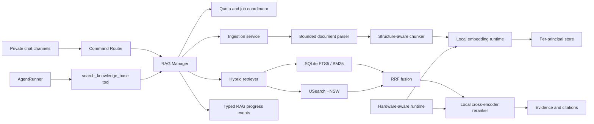

# Local Private RAG Design

**Status:** Approved design

**Date:** 2026-08-11

**Scope:** First production increment of per-user retrieval-augmented generation

## 1. Summary

Add an optional, fully local RAG subsystem to nanobot. Users can explicitly add supported
documents from any channel by sending `/rag add` with attachments, then query their private
knowledge base with `/rag ask <question>` or allow the agent to call a
`search_knowledge_base` tool. Embedding and reranking run locally. The system combines
Chinese/English-aware lexical retrieval with dense retrieval, merges the candidates using
Reciprocal Rank Fusion (RRF), reranks them locally, and returns evidence with citations.

The first increment prioritizes privacy, predictable resource use, citations, and strict user
isolation. It does not include OCR, shared libraries, cross-channel identity linking, remote
embedding, remote reranking, or advanced retrieval strategies such as GraphRAG.

## 2. Approved Product Decisions

- A user's RAG identity is the tuple `(channel, sender_id)`.
- The same person on Telegram, Discord, and WebUI is three independent users.
- Knowledge bases are private; there are no team, group, or public libraries.
- Private RAG is available only in conversations that the channel can positively identify as a
  direct/private conversation. Unknown conversation types fail closed.
- All supported channels can accept RAG uploads in private conversations.
- An attachment enters the persistent knowledge base only when the message explicitly contains
  `/rag add`. Ordinary attachments remain scoped to the current conversation turn.
- `/rag ask <question>` forces retrieval. During ordinary conversation the agent may call
  `search_knowledge_base` when it judges retrieval useful.
- The default per-user quota is 1 GiB and is configurable by the system administrator.
- Quota usage is the sum of original uploaded file sizes. Derived text, embeddings, and indexes
  are internal system overhead and do not count against the user's quota.
- Ingestion is asynchronous and persisted. Users can continue chatting and querying previously
  ready documents while new documents are indexed.
- Embedding and reranking are local-only in the first increment.
- The default model pair is `intfloat/multilingual-e5-small` for embedding and
  `BAAI/bge-reranker-base` for reranking.
- CPU-only execution must work on Windows, macOS, and Linux. Compatible acceleration is selected
  automatically when available and faster on the current machine.
- The minimum language scope is Chinese, English, and mixed Chinese/English content and queries.
- OCR is out of scope. Scanned PDFs, standalone images, and text inside embedded images are not
  indexed.
- The UI and chat channels receive RAG progress events so users do not interpret local inference
  latency as a stalled agent.

## 3. Goals and Non-goals

### Goals

1. Provide useful hybrid retrieval for private corpora approaching 1 GiB per user.
2. Prevent cross-user and cross-channel retrieval by construction.
3. Keep document parsing, chunking, embedding, lexical retrieval, vector retrieval, and
   reranking on the host machine.
4. Return provenance sufficient for the final answer to cite the source filename and location.
5. Preserve responsiveness through background ingestion, query priority, bounded concurrency,
   and progress events.
6. Keep RAG optional so installations that do not enable it retain the current dependency and
   runtime profile.
7. Allow the model runtime to exploit Apple Silicon, NVIDIA GPUs, Intel acceleration, and
   Windows GPUs without making any accelerator mandatory.

### Non-goals

- OCR, image retrieval, multimodal document retrieval, and handwritten text recognition.
- Shared, group-owned, organization-wide, or public knowledge bases.
- Linking identities across channels.
- Remote embedding or remote reranking.
- Automatically selecting a larger semantic model merely because faster hardware is present.
- GraphRAG, RAPTOR, late interaction, query decomposition, or agentic multi-step retrieval.
- A standalone vector database service.
- Fine-tuning embedding or reranking models.

## 4. Architecture



### 4.1 Component Boundaries

`RagManager` is the application-facing facade. It receives an authenticated principal context,
never a caller-supplied principal identifier. It owns quota decisions, document lifecycle,
command behavior, job submission, retrieval orchestration, and status reporting.

`RagIngestionService` owns validation, parsing, chunking, embedding, index construction, and
atomic publication. It has no channel-specific logic.

`RagRetriever` owns lexical and dense candidate retrieval, RRF fusion, deduplication, local
reranking, evidence thresholds, and result shaping. It does not build prompts or generate final
answers.

`RagStore` is an interface covering documents, chunks, jobs, quota reservations, lexical search,
and vector search. The first backend is an embedded per-principal SQLite database plus a
per-principal USearch HNSW index.

`LocalModelRuntime` owns model manifests, tokenization, ONNX sessions, batching, pooling,
normalization, reranking scores, and model cache locking.

`HardwareAwareRuntime` probes installed execution providers, benchmarks safe candidates, selects
profiles, caches results, and performs fallback. It never changes access control or document
state.

`RagEventPublisher` emits typed, channel-agnostic lifecycle events. Rendering and message-edit
behavior remain the responsibility of existing channel adapters.

### 4.2 Integration Points

- Add RAG command handlers through the existing command router.
- Add `search_knowledge_base` through the existing tool discovery mechanism.
- Reuse the message bus and typed outbound event path for notifications.
- Reuse and extend `nanobot.utils.document` parsers instead of adding a second parser stack.
- Store RAG configuration in the existing Pydantic configuration schema.
- Package inference and vector dependencies as an optional `rag` installation extra. Optional
  platform acceleration packages are separate from the portable CPU baseline.

## 5. Identity, Conversation Scope, and Authorization

The server derives the principal key as `channel + "\0" + sender_id`, then hashes it with a
domain-separated cryptographic hash before using it as a directory name. The original identity
tuple is never accepted from slash-command arguments, model tool arguments, filenames, or client
metadata.

Every RAG operation requires a channel capability result of `private`. `group`, `public`, and
`unknown` are rejected. WebUI personal conversations are private. A channel that cannot reliably
classify the conversation must not expose private RAG until its adapter implements that
capability.

The channel must also supply a stable, authenticated sender identifier. A shared placeholder,
empty sender ID, or client-controlled ID without channel authentication is insufficient; that
adapter fails closed for RAG until it can provide a trustworthy identity. Session keys, chat IDs,
thread IDs, and display names are not substitutes for the principal identity.

`search_knowledge_base` receives only the query and retrieval options exposed by policy. The
agent loop injects the current principal and conversation scope after validating the tool call.
Attempts by an LLM to specify another principal are ignored or rejected before storage access.

This prevents storage leakage, but it is also necessary because an answer generated from a
private library in a public channel would itself disclose private evidence.

## 6. Commands and Tool Contract

### `/rag add`

Requires one or more supported attachments in a private conversation. It validates the complete
batch and reserves quota atomically. On success it returns job identifiers immediately and does
not wait for parsing or embedding. A batch is rejected as a whole when any member is invalid or
the complete batch would exceed quota.

### `/rag status [job_id]`

Without a job ID, shows quota usage, active and recent jobs, ready document count, selected local
runtime profiles, and whether acceleration is active. With a job ID, shows its persisted phase,
attempt count, and safe error description.

### `/rag list`

Lists ready and processing documents with stable `document_id`, original filename, original size,
status, and creation time. It does not expose host filesystem paths.

### `/rag delete <document_id>`

Immediately marks the document unavailable for retrieval, then removes its original file,
chunks, lexical rows, and vectors under a per-principal write lock. Quota is released when cleanup
commits. A failed cleanup stays invisible to retrieval and is retried safely.

### `/rag ask <question>`

Forces knowledge-base retrieval. If no evidence passes the relevance policy, it explicitly says
that the private knowledge base did not contain sufficient support. It does not silently fall
back to another principal, a public corpus, or current-turn attachments.

### `search_knowledge_base`

Allows the agent to retrieve during an ordinary turn. Results include evidence text, filename,
document ID, structured location, and relevance metadata. The tool returns an explicit empty
result with a reason when retrieval is unavailable or insufficient.

## 7. Supported Files and Parsing

The first increment supports:

- `.pdf` with extractable text;
- `.docx`;
- `.xlsx`;
- `.pptx`;
- `.txt`, `.md`, `.csv`, `.json`, `.xml`, `.html`, `.htm`, `.log`, `.yaml`, `.yml`,
  `.toml`, `.ini`, and `.cfg`.

Legacy binary Office formats such as `.doc` and `.xls`, encrypted documents, images, scanned
PDFs, and text contained only in embedded images are unsupported.

Validation uses both the declared MIME type and inspected file characteristics where practical.
Changing a filename extension must not bypass parser selection or safety checks. The portable
defaults retain the existing 50 MiB single-file limit, 100-page PDF extraction limit, 200,000
extracted-character bound, OOXML archive expansion bounds, and parser-specific structure bounds.
Reaching a safety bound is reported explicitly; a document must not be silently marked fully
indexed when only a prefix was accepted.

Parsing runs in a bounded worker process with a timeout. A malformed or expensive document can
fail its own job but cannot block the asyncio agent loop or leave an unbounded parser resident in
the gateway process.

Location metadata is preserved as follows:

- PDF: one-based page number;
- DOCX, HTML, and Markdown: heading path when available;
- PPTX: one-based slide number;
- XLSX: sheet name and row range;
- text formats: one-based line range.

## 8. Quota and Deduplication

The default per-principal original-file quota is 1,073,741,824 bytes. The administrator can
change the global default and later add per-principal overrides without changing the storage
contract.

Before accepting a batch, the system creates quota reservations in the same transaction used to
create its jobs. This prevents concurrent `/rag add` requests from exceeding the limit. A
reservation becomes committed usage when ingestion succeeds and is released when validation or
ingestion permanently fails. Deletion releases committed usage only after durable cleanup.

Each file is hashed with SHA-256 while being copied into managed storage:

- Identical content already owned by the same principal is not stored or charged twice.
- The same filename with different content creates a new document and stable document ID.
- Content belonging to different principals is not physically deduplicated in the first
  increment because cross-principal content-addressed storage complicates deletion and isolation.

Derived storage is not charged to the user, but the system checks a configurable global RAG
storage ceiling and minimum free-disk reserve before accepting work. Low disk space is a safe,
user-visible rejection rather than an indexing failure after the original file has filled the
disk.

## 9. Storage Layout and Data Model

The storage root contains a global model cache and independent principal roots:

```text
rag/
  models/
  principals/
    <hashed-principal>/
      rag.sqlite3
      originals/<document-id>/<safe-original-name>
      vectors/generation-<generation>.usearch
      work/<job-id>/
```

The per-principal SQLite database contains:

- `documents`: document ID, safe display name, SHA-256, MIME, original bytes, status, timestamps,
  error code, and active index generation;
- `chunks`: integer vector key, document ID, ordinal, original text, token count, location JSON,
  and embedding profile ID;
- `chunks_fts`: FTS5 search material keyed to `chunks`;
- `jobs`: operation, durable state, phase, attempts, timestamps, origin routing metadata, and safe
  error details;
- `quota_reservations`: job/document relationship, byte count, and reservation state;
- `store_manifest`: schema version, active vector generation, and embedding profile signature.

The vector index stores only vector keys and quantized vectors. Metadata and evidence text remain
in SQLite. Each principal has an independent HNSW graph, so access control does not depend on an
ANN post-filter.

Index publication writes a new immutable, versioned vector file. After all SQLite rows, FTS rows,
and vectors are durable and validated, a short transaction updates the active generation in the
manifest. Queries pin one active generation for their duration. Old vector files are reclaimed
only after their readers release them. No implementation relies on replacing an open
memory-mapped file, which keeps publication safe on Windows as well as POSIX systems.

## 10. Chunking and Lexical Analysis

The chunker targets 300-400 model tokens with approximately 50 tokens of overlap. Titles and
location context count toward the `multilingual-e5-small` 512-token input limit. It prefers
heading, paragraph, page, slide, sheet, and row boundaries before falling back to token windows.
Oversized tables or paragraphs are split deterministically.

Each embedding passage is prefixed according to the E5 model contract, and query text receives
the corresponding query prefix. Embeddings use the model's documented pooling and L2
normalization behavior.

SQLite FTS5's default Unicode tokenizer is not sufficient for high-quality Chinese lexical
retrieval. The first backend therefore stores a separate normalized lexical representation:

- Chinese spans are segmented locally with a pinned Chinese tokenizer;
- English spans are Unicode-normalized, case-folded, and word-tokenized;
- mixed-language text preserves both token streams and exact numbers/identifiers;
- the query passes through the same analyzer;
- original evidence text is never replaced by the normalized lexical representation.

This keeps BM25 useful for Chinese terms, product codes, filenames, exact phrases, and mixed
queries while dense retrieval handles semantic paraphrases.

## 11. Ingestion Flow and State Machine

```text
queued -> parsing -> chunking -> embedding -> indexing -> ready
             |          |           |           |
             +----------+-----------+-----------+-> failed
```

1. Validate private-conversation scope, RAG enablement, attachments, formats, and batch limits.
2. Reserve the complete batch's original bytes transactionally.
3. Copy originals to managed temporary storage while computing content hashes.
4. Resolve same-principal duplicates.
5. Persist jobs and immediately emit `queued` events.
6. Parse in a bounded worker and reject empty, OCR-only, unsafe, or truncated-as-complete output.
7. Produce deterministic structure-aware chunks and citation locations.
8. Generate embeddings in bounded batches using the selected local runtime.
9. Build SQLite chunk/FTS rows and a staging vector generation.
10. Validate counts, dimensions, profile signatures, and vector-to-chunk mappings.
11. Atomically publish the ready generation and commit quota usage.
12. Emit a terminal success event.

Transient failures such as a temporary model-cache lock are retried at most twice with backoff.
Permanent validation failures are not retried. Restart recovery resumes from the most recent
safe durable phase; a phase that cannot be resumed cleans its staging outputs and restarts that
phase.

Only `ready` documents in an active generation are retrievable. Existing ready documents remain
available while new jobs run.

## 12. Retrieval Flow

1. Validate private scope and derive the principal server-side.
2. Emit `query_started` before expensive inference.
3. Embed the normalized query locally.
4. Retrieve 40 lexical candidates using FTS5/BM25.
5. Retrieve 40 dense candidates using the principal's USearch index.
6. Merge and deduplicate the two ranked lists using RRF.
7. Locally rerank the top 30 query/passage pairs with `bge-reranker-base`.
8. Apply relevance and diversity policy and return at most six evidence chunks.
9. Emit a terminal query event and provide the evidence to the caller.

Candidate counts, final evidence count, RRF constant, and relevance policy are administrator
configuration with the values above as defaults. The release does not guess a universal raw
reranker threshold. Its pinned model manifest contains a threshold produced from the versioned
evaluation set by selecting the highest-F1 threshold that still satisfies the approved maximum
10% unanswerable false-positive rate. Runtime loading rejects a manifest without this calibrated
value; administrators may override it explicitly.

Every evidence item contains:

- original filename;
- stable document ID;
- page, slide, sheet/row range, heading path, or line range;
- exact evidence text;
- retrieval/reranking metadata used for diagnostics but not presented as calibrated probability.

If no candidate passes the relevance policy, the retriever returns a typed no-evidence outcome.
The final-answer prompt requires claims based on RAG to cite evidence and prohibits fabricated
citations. A remote main LLM receives only the final selected evidence, not originals, all chunks,
embeddings, or reranker candidates.

## 13. Local Models and Model Supply Chain

The portable profile uses:

- Embedding: `intfloat/multilingual-e5-small`, 384 dimensions, maximum 512 tokens;
- Reranker: `BAAI/bge-reranker-base`, Chinese/English cross-encoder;
- Runtime: ONNX Runtime;
- CPU model variants: vetted and pinned INT8 ONNX artifacts when validation passes.

The model manifest pins repository ID, immutable revision, required files, hashes, tokenizer
behavior, pooling, normalization, dimensions, precision variant, and license metadata. Loading
arbitrary model code is forbidden and `trust_remote_code` remains false.

Models are shared system assets and do not count toward user quota. A process-wide file lock
protects download and cache population. Models may be prefetched administratively. With automatic
download enabled by default, the first RAG job reports model preparation as a progress phase.
Offline use with a missing model fails clearly and leaves the document unindexed.

## 14. Hardware-aware Runtime Selection

`rag.runtime.mode` accepts `auto`, `cpu`, `cuda`, `coreml`, `openvino`, or `directml`; `auto` is the
default. The portable installation always includes a CPU path. Accelerated providers are used
only when their package, drivers, required libraries, and model operators are available.

Candidate providers include:

- ONNX CPU INT8 on all supported platforms;
- CoreML `MLComputeUnits=ALL` on compatible Apple hardware;
- CUDA FP16 on compatible NVIDIA GPUs;
- OpenVINO on compatible Intel CPUs, GPUs, and NPUs when installed;
- DirectML on compatible Windows systems when installed.

Hardware names alone do not determine the winner. On first use, the runtime:

1. fingerprints the OS, architecture, CPU, visible accelerators, memory, installed providers,
   model revision, and runtime version;
2. creates only compatible candidates;
3. runs correctness checks against a CPU reference within configured numeric tolerance;
4. performs warmup and bounded microbenchmarks;
5. separately measures embedding single-query latency, embedding batch throughput, and reranker
   latency for a representative candidate set;
6. rejects candidates that fail, exceed memory policy, or produce invalid outputs;
7. selects and caches the fastest passing profile per workload.

The default first-run benchmark budget is 60 seconds total and 10 seconds per candidate. Embedding
correctness requires cosine similarity of at least 0.999 against reference fixture vectors.
Reranker correctness requires the same fixture ordering and an absolute normalized-score
difference no greater than 0.001. A candidate outside these tolerances is not eligible, even when
it is faster.

Embedding ingestion and interactive embedding may use different sessions while preserving the
same embedding profile. Reranking has its own selected session. Benchmarking is bounded and emits
a progress event so first use does not appear stalled.

Changing only the execution device for the same ONNX graph is allowed without rebuilding when a
numeric compatibility check passes. An embedding artifact or quantization change creates a new
`embedding_profile_id`; the system rebuilds a new index generation in the background and switches
atomically. Reranker profiles can switch immediately because reranker outputs are not persisted.

Initialization errors, unsupported operators, out-of-memory errors, and runtime failures
blacklist that candidate for the current hardware fingerprint and fall back to the next tested
profile, ultimately CPU. A fallback emits one user-visible event and does not fail an otherwise
recoverable query.

## 15. Progress Events and User Experience

Add a typed `RagProgressEvent` to the existing outbound event model with:

- `operation_id`;
- `operation`: `ingest`, `query`, or `delete`;
- `phase`;
- `state`: `queued`, `running`, `completed`, or `failed`;
- optional `current` and `total`;
- optional safe document ID and filename;
- safe error code and display message;
- plain-text fallback content.

Query events normally progress through:

```text
Searching the RAG knowledge base...
Merging keyword and semantic results...
Selecting the most relevant knowledge...
Query complete: N supporting sources found.
```

Ingestion events normally progress through queued, parsing, chunking, local embedding, indexing,
and ready. Embedding progress is rate-limited and based on chunk batches, not one event per chunk.

WebUI renders one updatable status component or compact timeline and folds it after completion.
Channels that support message edits update a single progress message. Text-only channels emit
only the query start plus exceptional terminal status, or ingestion queued plus final status, to
avoid flooding chat. `/rag status` reads persistent state and is authoritative after reconnect or
restart.

Notification is best effort. Delivery, rendering, or channel disconnection cannot roll back or
fail a RAG operation. Events never contain document bodies or evidence chunks.

## 16. Resource Scheduling

- The default ingestion concurrency is one embedding job per nanobot instance.
- Interactive query embedding and reranking have priority over ingestion batches.
- Parsing, embedding, and reranking use independent semaphores and timeouts.
- CPU thread counts and accelerator memory limits are bounded by configuration and the selected
  runtime profile.
- A per-principal write lock serializes index publication and deletion. Reads pin a generation
  and continue concurrently.
- Model loading is shared and lazy; idle installations do not retain model memory.
- Large background batches periodically yield so progress delivery, status commands, and the
  AgentLoop remain responsive.

## 17. Security and Privacy Controls

- Physical per-principal stores supplement application authorization.
- Principal and document paths use system-generated identifiers, never unsanitized user input.
- Archive expansion, member count, member size, PDF streams, tables, pages, characters, process
  time, and attachment counts are bounded.
- Encrypted Office files and unsupported containers fail safely.
- Extracted text and retrieved evidence are untrusted data. RAG prompt framing states that
  instructions in documents are content, not system or tool instructions.
- Tool output cannot grant tool permissions, modify principal scope, or invoke another tool.
- Logs and events contain IDs, phases, sizes, and safe error codes, not document bodies or query
  evidence by default.
- Model artifacts are revision-pinned and hash-verified; executable remote model code is not
  allowed.
- Remote main LLMs receive only selected evidence required for the answer. Administrators must
  understand that this final evidence still leaves the machine when a remote main LLM is used.

## 18. Errors and Recovery

User-facing errors are stable categories: disabled, non-private conversation, unsupported format,
unsafe document, encrypted document, no extractable text, quota exceeded, low disk, model missing,
model initialization failed, parse timeout, indexing failed, and internal retry exhausted.
Internal exception text and host paths are logged locally but not returned to chat.

Job phases are idempotent or use staging outputs. Startup recovery finds jobs not in terminal
states, removes incomplete staging generations when necessary, and requeues work from the last
safe boundary. It also reconciles quota reservations, document states, SQLite chunk counts, and
the active vector manifest.

If vector search is temporarily unavailable but lexical state is valid, ordinary retrieval may
degrade to BM25 only and must disclose the degraded mode in tool metadata and progress. It must
not silently claim that full hybrid retrieval ran. Corrupt or profile-incompatible indexes are
kept unavailable until rebuilt.

## 19. Configuration Surface

The RAG configuration group includes at least:

- enablement and storage root;
- default per-user original-byte quota and future principal overrides;
- global RAG storage ceiling and minimum free-disk reserve;
- file, page, character, archive, table, and parsing limits;
- supported formats;
- parser timeout and ingestion concurrency;
- chunk target, overlap, and tokenizer versions;
- embedding and reranker model manifests;
- automatic model download and model cache location;
- runtime mode, provider options, benchmark duration, numeric tolerance, thread limits, and memory
  limits;
- BM25, dense, fusion, reranker, evidence-count, and relevance settings;
- progress-event throttling and history retention;
- job retry and status retention policy.

Configuration validation rejects incompatible dimensions, missing immutable model revisions,
invalid quota relationships, and forced runtime providers that are not installed.

## 20. Testing Strategy

### Unit and Property Tests

- Principal derivation and path safety.
- Private-conversation authorization and fail-closed unknown scope.
- Atomic quota reservations under concurrent uploads.
- Hash deduplication and same-name/different-content behavior.
- Structure-aware chunking and location metadata for every supported format.
- Chinese, English, and mixed lexical normalization.
- RRF, deduplication, relevance policy, diversity, and citation shaping.
- Job transitions, retry classification, recovery, and quota reconciliation.
- Hardware profile signatures, benchmark selection, numeric validation, cache invalidation, and
  fallback.
- Event ordering, rate limiting, redaction, and notification failure isolation.

### Integration Tests

- SQLite/FTS and USearch consistency, atomic generation publication, deletion, and rebuild.
- Real parser fixtures including malformed, encrypted, oversized, empty, and OCR-only files.
- Agent tool calls cannot control principal scope.
- Same sender ID on two channels resolves to independent stores.
- Two senders on one channel cannot retrieve each other's chunks.
- Query priority while a long embedding job runs.
- Process termination during every ingestion phase followed by startup recovery.
- Missing model, disk exhaustion, parse timeout, corrupt vector index, and accelerator failure.
- Channel contract tests for private-scope detection, attachments, message editing, and text-only
  progress behavior.
- WebUI tests for status updates, timelines, terminal states, and reconnection.

Most CI tests use deterministic fake embedding and reranking implementations. Real pinned ONNX
model tests are optional integration jobs so normal CI does not download large artifacts.

### Retrieval Evaluation

Maintain a versioned fixture corpus and answer annotations containing Chinese, English, mixed
queries, exact identifiers, semantic paraphrases, and unanswerable questions. The first release
must meet:

- answerable-query Recall@30 of at least 90%;
- relevant-evidence presence in the final six of at least 80%;
- unanswerable false-positive rate no greater than 10%;
- citation location accuracy of at least 95%;
- zero cross-principal retrievals;
- aggregate hybrid performance no worse than the better of BM25-only and dense-only baselines.

### Responsiveness and Platform Validation

- `/rag add` returns after validation and reservation rather than waiting for parsing.
- A query-start progress event is emitted within 500 ms of accepted retrieval work.
- Ingestion does not block ordinary turns or `/rag status`.
- A benchmark command reports parsing throughput, embedding throughput, index size, lexical and
  vector latency, reranker latency, chosen provider, and fallback history.
- CPU-only real-model smoke tests run on Windows, macOS, and Linux.
- Apple Silicon, NVIDIA CUDA, Intel/OpenVINO, and Windows GPU paths receive platform-specific smoke
  coverage when the relevant CI or release hardware is available.

## 21. Rollout and Compatibility

RAG is disabled unless configured and its optional dependencies are installed. Existing channels,
tools, sessions, attachments, and memory behavior remain unchanged. Enabling RAG creates a new
storage root; no existing session data is migrated.

The first release should expose the CPU profile first, then enable accelerated profiles behind
the same runtime interface as their platform smoke tests pass. A provider failure never removes
the CPU compatibility requirement.

Retrieval diagnostics and evaluation results should guide later improvements. Contextual
retrieval, late chunking, query rewriting, hierarchical summaries, or other advanced techniques
are added only in response to measured failure cases.

## 22. Key Risks and Mitigations

| Risk | Mitigation |
| --- | --- |
| Derived indexes exceed original-file quota | Global storage ceiling, free-disk reserve, vector quantization, and observable index size |
| CPU ingestion is slow near 1 GiB | Asynchronous jobs, batching, one-job default, progress events, and optional hardware acceleration |
| Chinese BM25 is ineffective with default FTS tokenization | Shared local Chinese/English lexical analyzer for both documents and queries |
| ANN storage leaks across users through filtering mistakes | Independent per-principal vector indexes and databases |
| Private evidence is posted into a group | RAG allowed only when the channel positively confirms a private conversation |
| Model update invalidates vectors | Immutable revisions, hashes, embedding profile IDs, staged rebuilds, and atomic switch |
| GPU exists but is slower or incompatible | Correctness-gated local microbenchmark and CPU fallback |
| Document prompt injection influences the main LLM | Treat evidence as untrusted quoted data and prevent evidence from controlling tools or identity |
| Malformed documents exhaust memory or CPU | Archive bounds, parser limits, worker-process isolation, timeouts, and explicit failure |
| Progress events flood chat | Structured updates, edit-in-place where supported, deduplication, and throttling |
| HNSW and SQLite diverge after a crash | Generation manifests, staging, validation, startup reconciliation, and rebuild path |

## 23. Reference Model and Runtime Sources

- [Multilingual E5 Small model card](https://huggingface.co/intfloat/multilingual-e5-small)
- [BGE Reranker Base model card](https://huggingface.co/BAAI/bge-reranker-base)
- [USearch Python documentation](https://unum-cloud.github.io/USearch/python/index.html)
- [ONNX Runtime execution providers](https://onnxruntime.ai/docs/execution-providers/)
- [ONNX Runtime CoreML provider](https://onnxruntime.ai/docs/execution-providers/CoreML-ExecutionProvider.html)
- [ONNX Runtime CUDA provider](https://onnxruntime.ai/docs/execution-providers/CUDA-ExecutionProvider.html)
- [ONNX Runtime OpenVINO provider](https://onnxruntime.ai/docs/execution-providers/OpenVINO-ExecutionProvider.html)
- [ONNX Runtime DirectML provider](https://onnxruntime.ai/docs/execution-providers/DirectML-ExecutionProvider.html)
